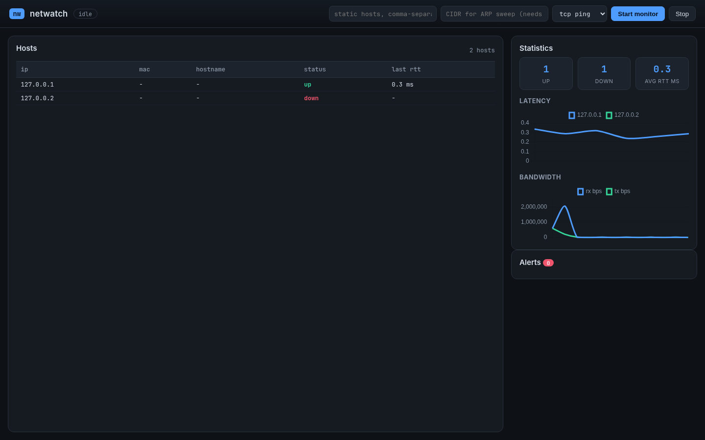

# netwatch

A real-time local-network monitoring dashboard: host discovery, latency and
bandwidth monitoring, and heuristic alerting (host-down, latency/bandwidth
spikes, ARP spoofing), backed by a SQLite time-series store and streamed live
to a browser over WebSockets. The same detection engine also drives a
command-line interface and a small lab-only offensive tool used to exercise
the ARP-spoof detector end to end.

> **Scope and ethics.** This project is for **educational, defensive and
> offensive** security learning. Run live ARP discovery and ICMP probing only
> against your own network, and run the offensive `attack arp-spoof` tool
> **only against hosts, gateways, or lab environments you own or are
> explicitly authorized to test.** It refuses non-lab (public) targets unless
> you pass an explicit `--i-understand-lab` opt-in.

## Screenshots

The dashboard monitoring two local hosts over TCP-connect probing: one up,
one down (triggering a `host_down` alert), with live latency and bandwidth
charts.



## Features

- **Host discovery**: ARP sweep of a subnet (privileged) or a static host
  list (no privileges) -- the project is fully usable and testable without
  root or a real LAN.
- **Latency monitoring**: ICMP ping (privileged) or TCP-connect timing
  (unprivileged, the default).
- **Bandwidth monitoring**: per-interface throughput via `psutil`.
- **Alerts**: host-down / host-recovered, latency spikes, bandwidth spikes,
  and ARP-spoofing (a MAC address flapping back to a previous value inside a
  configurable window).
- **Historical data**: every host, sample, and alert is persisted to SQLite;
  the CLI and dashboard both read from the same store.
- **Two interfaces**: a CLI (`discover` / `monitor` / `stats` / `attack
  arp-spoof`) and a live web dashboard, sharing one engine.

## Architecture

```text
netwatch/
|-- core/        # models.py (Host, LatencySample, BandwidthSample, Alert) + config.py
|-- discovery/   # arp_scan.py: ARP sweep (privileged) + static-hosts fallback
|-- monitor/     # latency.py (ICMP/TCP probing) and bandwidth.py (psutil sampling)
|-- detect/      # alerts.py: sliding-window / rolling-baseline heuristic detectors
|-- storage/     # store.py: thread-safe SQLite time-series store
|-- offensive/   # guard.py (lab-target safety) + arp_spoof.py (MITM demo)
|-- ui/          # Flask + Socket.IO dashboard, templates and static assets
|-- evals/       # seeded synthetic corpora + precision/recall gate
|-- samples/     # offline demo script + example static-hosts file
|-- netwatch.py  # engine assembly: build_config() + the NetWatch class
|-- cli.py       # argparse CLI (discover / monitor / stats / attack)
`-- tests/       # pytest suite (runs unprivileged, offline, <2s)
```

Data flow: `discovery/` and `monitor/` produce `Host` / `LatencySample` /
`BandwidthSample` records; `netwatch.py`'s `NetWatch` class feeds each record
through `detect/alerts.py`, persists everything via `storage/store.py`, and
invokes callbacks. The CLI prints rows and alerts to the terminal; the web
dashboard batches the same callbacks and streams them to the browser over
Socket.IO every 250ms. Discovery, monitoring, and detection are fully
decoupled from the CLI/UI, so both front ends share one code path.

## Installation

Requires Python 3.11+. Live ARP discovery and ICMP ping also need `libpcap`
on the host (`sudo apt install libpcap0.8` on Debian/Ubuntu); the
static-hosts + TCP-connect path needs neither.

```bash
python3 -m venv .venv
. .venv/bin/activate
pip install -r requirements.txt
```

## Usage

### CLI

One-shot discovery against a static host list (no privileges):

```bash
python cli.py discover --static-hosts-file samples/static_hosts.json
```

Continuous monitoring:

```bash
python cli.py monitor --static-hosts-file samples/static_hosts.json \
    --method tcp --interval 5 --duration 60 --stats
```

ARP-sweep discovery and ICMP probing over a real subnet (needs privileges,
see below):

```bash
sudo python cli.py monitor --cidr 192.168.1.0/24 --method icmp --interval 5
```

Read back stored statistics:

```bash
python cli.py stats
```

Offline, no-privileges, no-network demo (spins up a local listener, shows
discovery, a `host_down` alert, and final stats):

```bash
python samples/demo_run.py
```

### Web dashboard

```bash
python ui/app.py        # then open http://127.0.0.1:5000
```

Enter a comma-separated static host list or a CIDR, pick a probe method, and
click **Start monitor**. The host table, latency/bandwidth charts, and alert
feed update live over WebSockets.

The dashboard loads Socket.IO and Chart.js from public CDNs, so the browser
needs internet access for those two assets.

## Privileges

| Path | Needs root / CAP_NET_RAW? |
| --- | --- |
| ARP sweep discovery (`--cidr`) | Yes |
| ICMP ping (`--method icmp`) | Yes |
| Static-hosts discovery | No |
| TCP-connect ping (`--method tcp`, default) | No |
| Bandwidth sampling (`psutil`) | No |

Either run with `sudo`, or grant the interpreter the capability once (applies
to that interpreter for all programs):

```bash
sudo setcap cap_net_raw,cap_net_admin+eip "$(readlink -f "$(which python3)")"
```

## Detection heuristics

| Alert | Trigger | Severity |
| --- | --- | --- |
| `host_down` | N consecutive missed probes (default 3) | high |
| `host_recovered` | first successful probe after being down | low |
| `latency_spike` | rtt exceeds a rolling per-host baseline x multiplier | medium |
| `bandwidth_spike` | rx/tx bps exceeds a rolling per-interface baseline x multiplier | medium |
| `arp_spoof` | a MAC address flaps back to a previously-seen value within a time window | high |
| `arp_spoof` | a MAC address changes with no flap-back (e.g. DHCP renewal) | low |

All thresholds live in `core/config.py`'s `DetectConfig`. These are
intentionally simple, explainable sliding-window heuristics, not a
production IDS.

## Offensive lab (own network only)

`offensive/arp_spoof.py` sends forged ARP replies to poison a target's and a
gateway's ARP caches -- a classic MITM technique. It exists specifically to
trigger netwatch's own `arp_spoof` detector: run `cli.py monitor` against the
target in one terminal, then run the attack in another, and watch the
high-severity alert fire once the MAC flaps back within the detection window.

```bash
sudo python cli.py attack arp-spoof --target-ip 192.168.1.50 --gateway-ip 192.168.1.1
```

Guarded by `offensive/guard.py`: both `--target-ip` and `--gateway-ip` must
be loopback/RFC1918/link-local addresses, or the tool refuses to run. Pass
`--i-understand-lab` to override for an authorized test against a
non-private target.

## Tests and evals

Gate suite (deterministic, offline, unprivileged, no root, no real network
or interface):

```bash
pytest -q
```

Current run: **71 passed in 1.10s**. Every module with a privileged code
path (`discovery/arp_scan.py`, `monitor/latency.py`, `offensive/arp_spoof.py`)
is tested either through an injectable function (`sweep_fn`, `send_fn`) or
behind the lab guard, which runs before any network call -- so no test needs
raw-socket privileges or a real network interface.

Detection eval (seeded synthetic corpora, precision/recall gated, separate
from the pytest gate suite):

```bash
python -m evals.run_detection --seed 1337 \
    --recall-down 0.99 --precision-down 0.99 \
    --recall-arp 0.90 --precision-arp 0.75
```

Current run (seed 1337, the default): **host-down/recovered** -- 4,500
ticks across 30 synthetic hosts, precision 1.00, recall 1.00 (a deterministic
counting rule, so a correct implementation should score at or near perfect).
**ARP-spoof** -- 200 synthetic IPs across 30 scans each, precision 0.88,
recall 1.00. ARP-spoof-vs-benign-MAC-change is a genuinely harder
discrimination problem than host-down (a rare benign MAC flap can coincide
with the detection window, and a slow-flipping attacker can fall outside it)
-- this is a known, honest limitation, not tuned away, which is why its gate
threshold is lower.

## What this demonstrates

Full-stack development (Flask + Socket.IO backend, vanilla JS + Chart.js
frontend), networking (ARP, ICMP, TCP, per-interface bandwidth accounting),
real-time data visualization, explainable heuristic detection design with a
measurable precision/recall eval, dependency-injection for testing
privileged/networked code offline, and paired offensive/defensive tooling
under an explicit lab-only safety guard.
